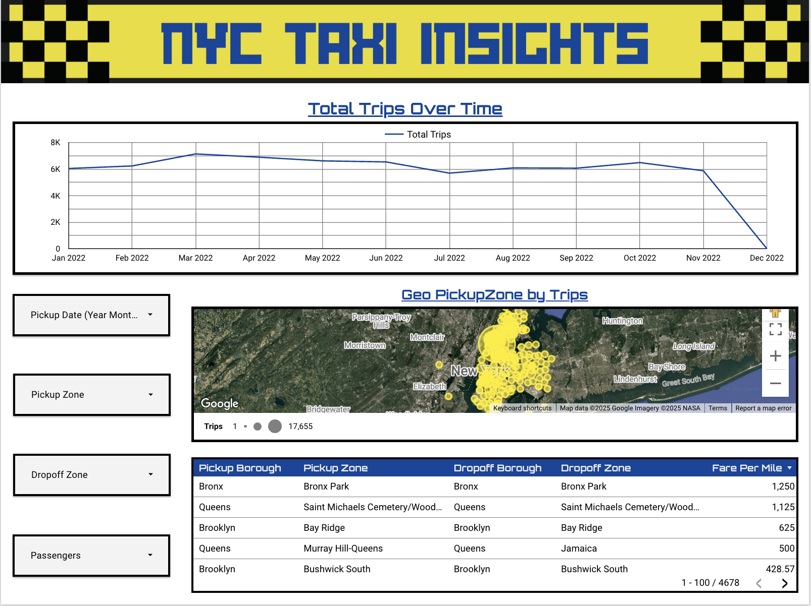

# NYC-Taxi-Trips-Dashboard

## 📊 Overview 
This interactive dashboard takes a look at all of the recorded New York City Taxi Trips made in the year 2022. It contains different visualizations to display the trips made and even sports an interactive Google Maps dashboard highlighting the most dense areas where trips are made. Along with a simple google sites page to have both of my NYC taxi projects side by side for easy access. 

## 🔧 Tools Used
- Google Looker Studio
- Google Sheets
- Google Maps
- Public NYC Taxt Trips Dataset
- Canva
- Google Sites

## 📌 Features
- Line Chart to display each month along with the number of trips in that month
- Controls and filters to allow user controls over: Pickup Date, Pickup Zone, Dropoff Zone, Passengers
- Geo Map to show the density of trips in certain areas
- Table showing the pickup information, dropoff information, along with the fare per mile

## 🌐 Live Dashboard
[👉 View Dashboard](https://lookerstudio.google.com/reporting/deb06341-f5e1-4fb0-85ef-40e7782cf676)

## 🖼️ Preview

## 🌎 Live Website
[👉 View Website](https://sites.google.com/view/nyc-taxi-insights/home)

